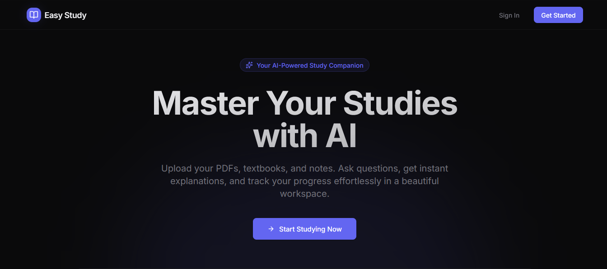
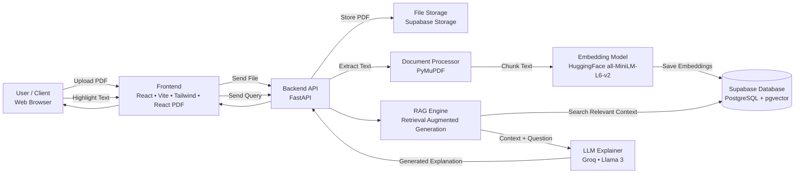
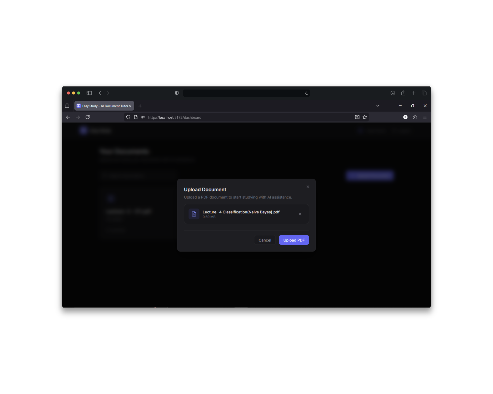
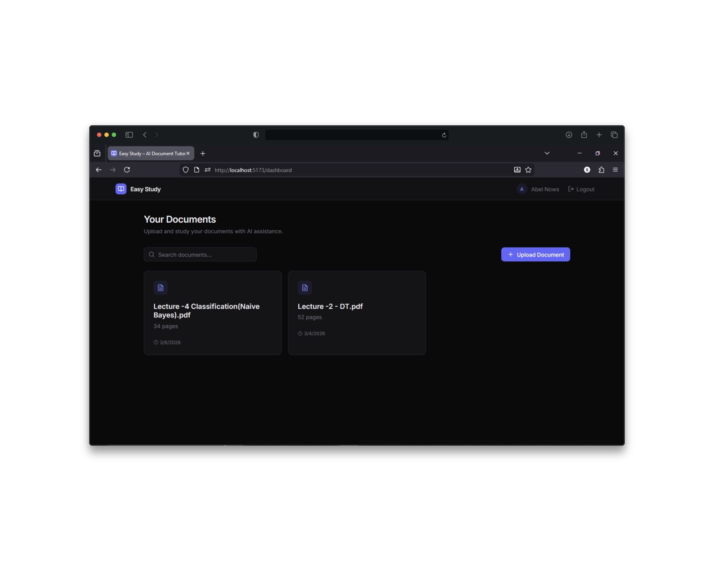
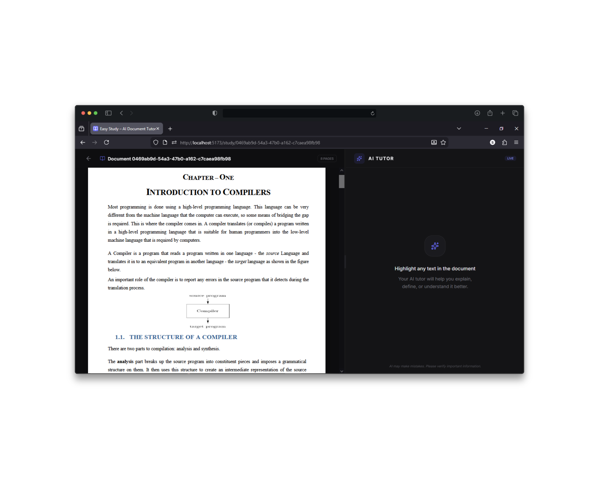
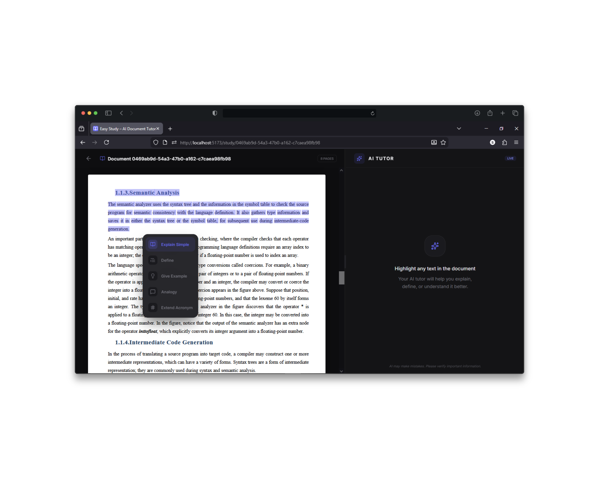
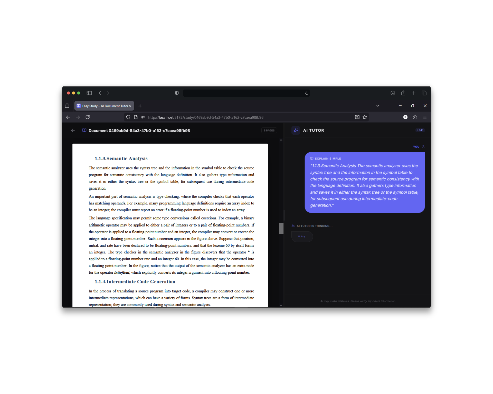
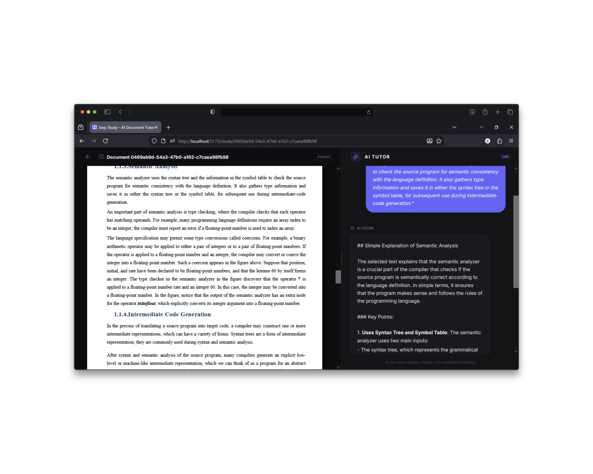

<div align="center">
  <div>
  
  <h1>Easy Study</h1>
</div>
  <p><strong>Your AI-powered document tutor. Upload PDFs and learn with contextual AI explanations.</strong></p>
  <p>
    
    
    
    
  </p>
  
</div>

---

## 🌟 Features

* 📄 **Smart PDF Uploads:** Effortlessly upload and parse your study materials.
* 🤖 **AI-Powered Explanations:** Receive contextual, intelligent explanations directly from your documents.
* ⚡ **Seamless Authentication:** Secure and fast login powered by Supabase.
* 📱 **Modern & Responsive UI:** A beautiful, intuitive layout built with Tailwind CSS and Framer Motion.

## 🛠️ Tech Stack

**Frontend**
* React 19 (Vite)
* Tailwind CSS + Framer Motion
* React PDF

**Backend**
* Python 3 & FastAPI
* SQLAlchemy
* PyMuPDF (Document Parsing)
* Supabase (Auth, PostgreSQL & Vector Embeddings)

**AI & Machine Learning**
* **Hugging Face (`all-MiniLM-L6-v2`)**: Leverages this lightweight, robust sentence-transformer model via the Hugging Face Inference API. It acts as the backbone for semantic search capabilities by efficiently converting PDF text chunks into semantic vector embeddings. This ensures that the context provided to the LLM is highly relevant to the specific questions.
* **Groq API**: Powers the rapid, intelligent generation of explanations using cutting-edge LLMs.


## 🏗️ System Architecture

*An overview of the Easy Study architecture for the nerds!*



---

## 🚀 Quick Start (Docker)

The fastest way to get Easy Study running locally is using Docker Compose.

### Prerequisites
* [Docker Desktop](https://www.docker.com/products/docker-desktop/) installed
* Git

### Installation

1. **Clone the repository:**
   ```bash
   git clone https://github.com/Samuel-Tefera/easy-study.git
   cd easy-study
   ```

2. **Setup Environment Variables:**
   Configure the environment variables before running the application. An `.env.example` file is provided in both the frontend and backend folders.
   * **Frontend:** Copy `frontend/.env.example` to `frontend/.env` and fill in your Supabase details.
   * **Backend:** Copy `backend/.env.example` to `backend/.env` and fill in the required API keys.

3. **Run the Application:**
   ```bash
   docker-compose up --build
   ```

4. **Access the App:**
   * Frontend: `http://localhost:5173`
   * Backend API / Swagger Docs: `http://localhost:8000/docs`

---

## 📸 Application Gallery

<table width="100%" cellspacing="2" cellpadding="0">
  <tr>
    <td align="center" width="50%"></td>
    <td align="center" width="50%"></td>
  </tr>
  <tr>
    <td align="center" width="50%"></td>
    <td align="center" width="50%"></td>
  </tr>
  <tr>
    <td align="center" width="50%"></td>
    <td align="center" width="50%"></td>
  </tr>
</table>

---

## 📝 License

This project is licensed under the MIT License - see the `LICENSE` file for details.